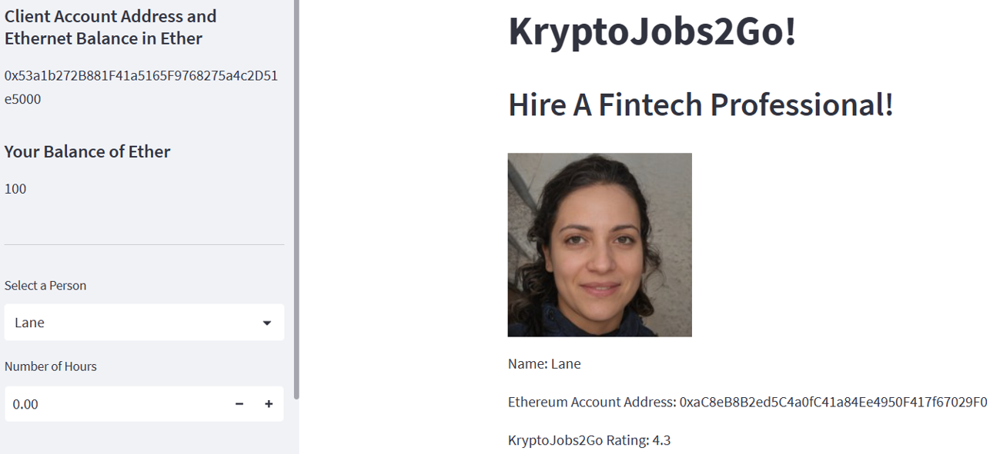
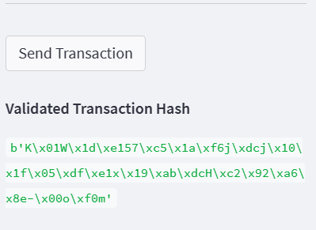
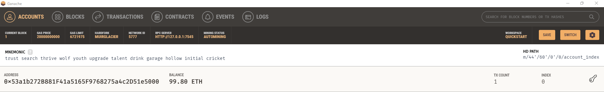
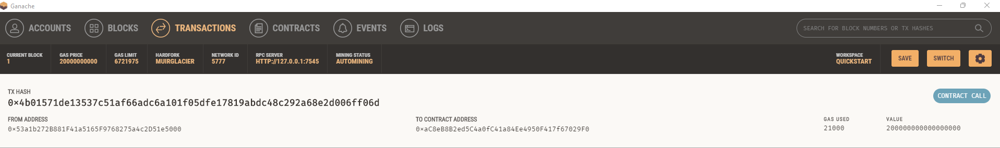

## Unit 19 Homework: Cryptocurrency Wallet

### Background

As a lead blockchain developer I've been tasked with integrating the Ethereum blockchain network into a system that can hire candidates and then pay them. The purpose is ultimately to enable customers to instantly pay their hired fintech professionals with cryptocurrency.

### Initial Streamlit Screenshot

The streamlit that was built shows the fintech professionals that the customer can hire as well as their cost per hour. Customers can choose the number of hours they would like to hire the FinTech professional. The system would then calculate the total and will allow the user to istantly pay the service provider.

### Validation Token

Once a payment is made via the app and is succesfull, the system will generate a validation hash for the transaction.

### Ganashe Wallet Balance

After the transaction, customers can then go to their wallet and see that their balance has decreased by the required amount.

### Ganashe Cryptocurrency Transaction

They will also be able to view the transaction from their respective wallet as per screenshot below.

